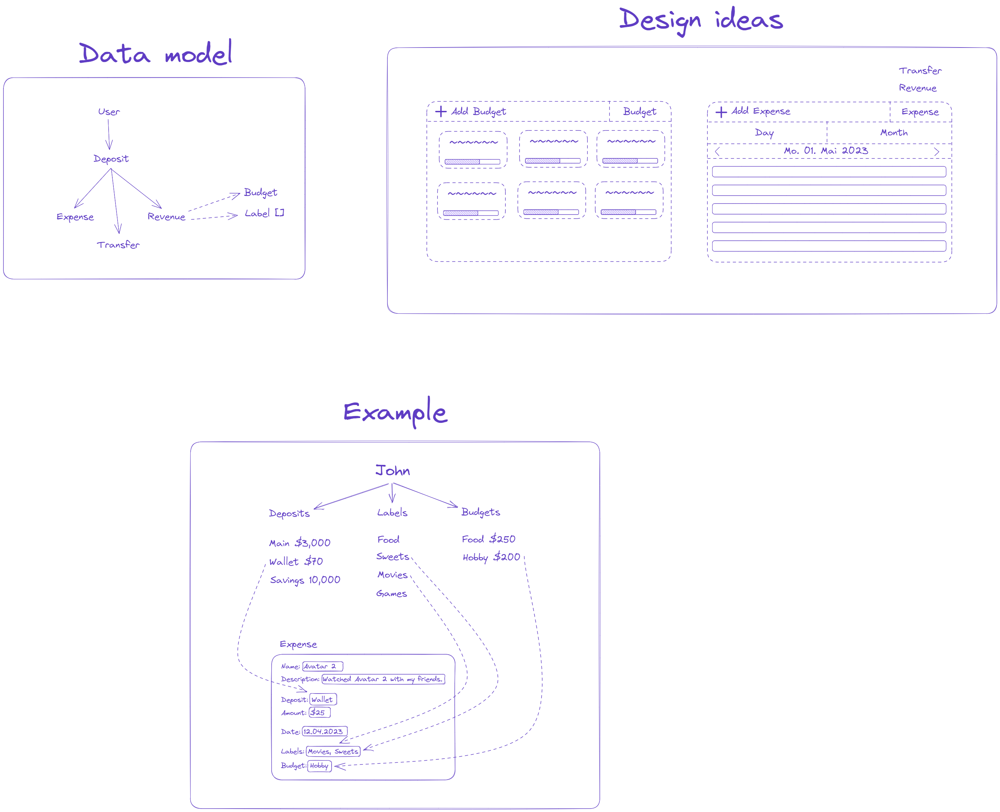

# Open Budget

Open Budget is an open source financ tracking application.
 

### Notes

## My T3 Stack
[Create T3 App](https://create.t3.gg/)

* [Next.js](https://nextjs.org/)
* [TypeScript](https://www.typescriptlang.org/)
* [React](https://reactjs.org/)
* [tRCP](https://trpc.io/)
* [Prisma](https://www.prisma.io/)
* [NextAuth.js](https://next-auth.js.org/)

### Assets
* [TailwindCSS](https://tailwindcss.com/)
* [Heroicons](https://heroicons.com/)
* [Headless UI](https://headlessui.dev/) - Would like to switch to [Radix UI](https://www.radix-ui.com/)

### Deployment
* [Vercel](https://vercel.com/)

### Database
* [Planetscale](https://planetscale.com/)
* [MySQL](https://www.mysql.com/)
